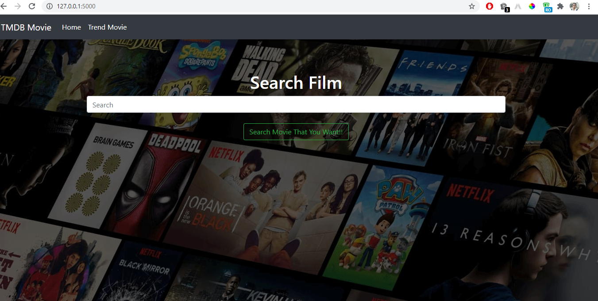
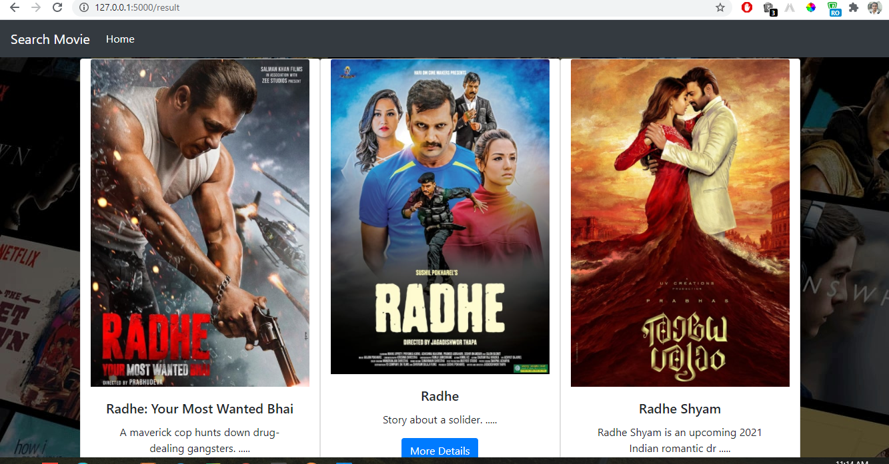
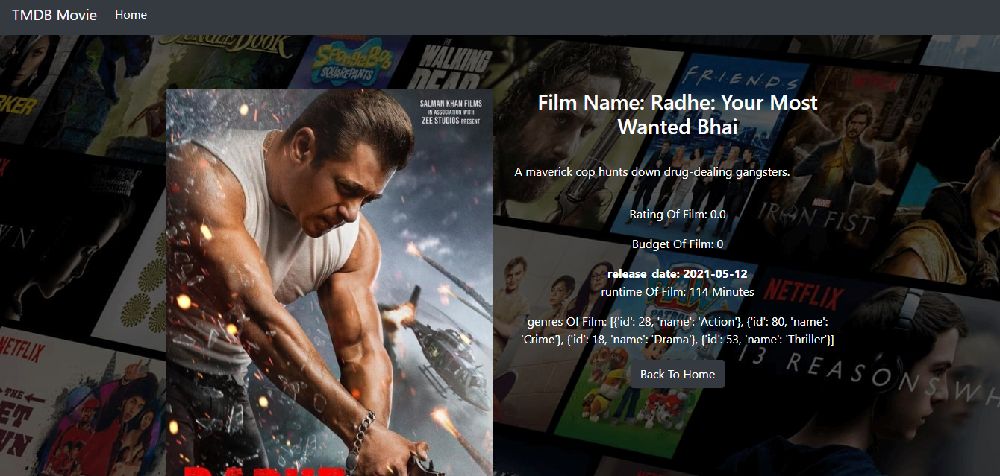
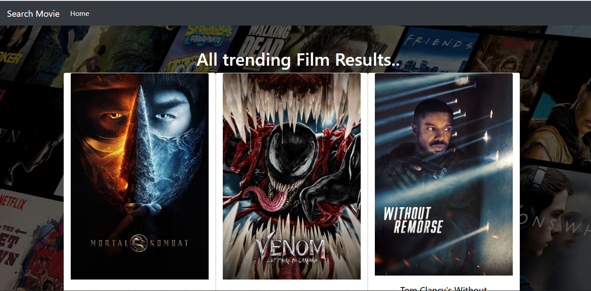

# Movie_App
Flask_Movie_App

### Description
A movie search app built with Flask using the TMDB API . The application makes use of the movie database API (tmdb).

### Features
Here are the features in summary:
* App displays  Trending Movie.
* User can search and review any movie.

### Requirements
* This program requires python3.+ (and pip) installed, a guide on how to install python on various platforms can be found [here](https://www.python.org/)
* Api use tmdb

## Technologies Used
    * Python 3.7.4
    * Flask 1.1.1
    * HTML  
    * CSS
    * PostgreSQL
    * Bootstrap 3.3.7

## Show your support

Give a ⭐️ if this project helped you!

